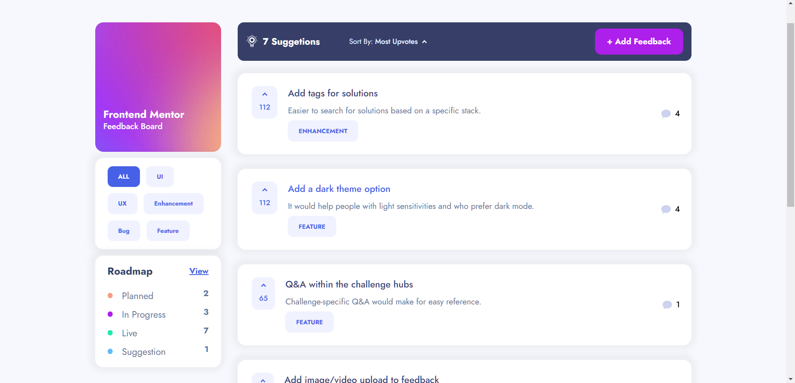

# Welcome to Product Feedback Web App! 🍃

This product feedback web app was a good challenge to put into practice my `Angular`, `Rxjs`, `NgRx` and `tailwind` skills. The project has many interactions that the user can play with. 

## Table of contents

- [Welcome to Product Feedback Web App! 🍃](#welcome-to-product-feedback-web-app-)
  - [Table of contents](#table-of-contents)
  - [Overview](#overview)
    - [Links](#links)
    - [The challenge](#the-challenge)
    - [Screenshot](#screenshot)
  - [My process](#my-process)
    - [Built with](#built-with)
    - [What I learned](#what-i-learned)
  - [Author](#author)

## Overview

### Links

- Live Project [In-browser markdown editor App](https://mouhametnd-product-feedback.netlify.app/#/)
- My Linkedin [Linkedin](https://www.linkedin.com/in/mouhametndiaye/)
- My email ahmetndiaye404@gmail.com

### The challenge

Users should be able to:

- Create, Read, Update, and Delete Feedback
- Upvote and Downvote Feedback
- Add comments to Feedback
- Reply comments of a Feedback
- Filter feedbacks
- Order feedbacks
- See a responsive design in any device
- Save documents in local storage. (so don't lose its changes after refreshing the page)

### Screenshot

## My process

### Built with

- Angular
- Rxjs
- NgRx
- Angular Router 
- Angular Reactive Forms 
- Tailwind CSS
- LocalStorage (to save documents and preferences to be accessed later)
- Mobile-first workflow

### What I learned

In this project, I've used `Angular` with `Rxjs` and `NgRx` to make the project, which helps me to get a better understanding of `Rxjs` library such as how to work with observables, and operators efficiently and how to implement and use state management in `Angular` using `NgRx` library.

## Author

- Portfolio - [Mouhamet Ndiaye](https://mouhametnd.com/)
- Frontend Mentor - [@fontend mentor](https://frontendmentor.io/challenges/)
